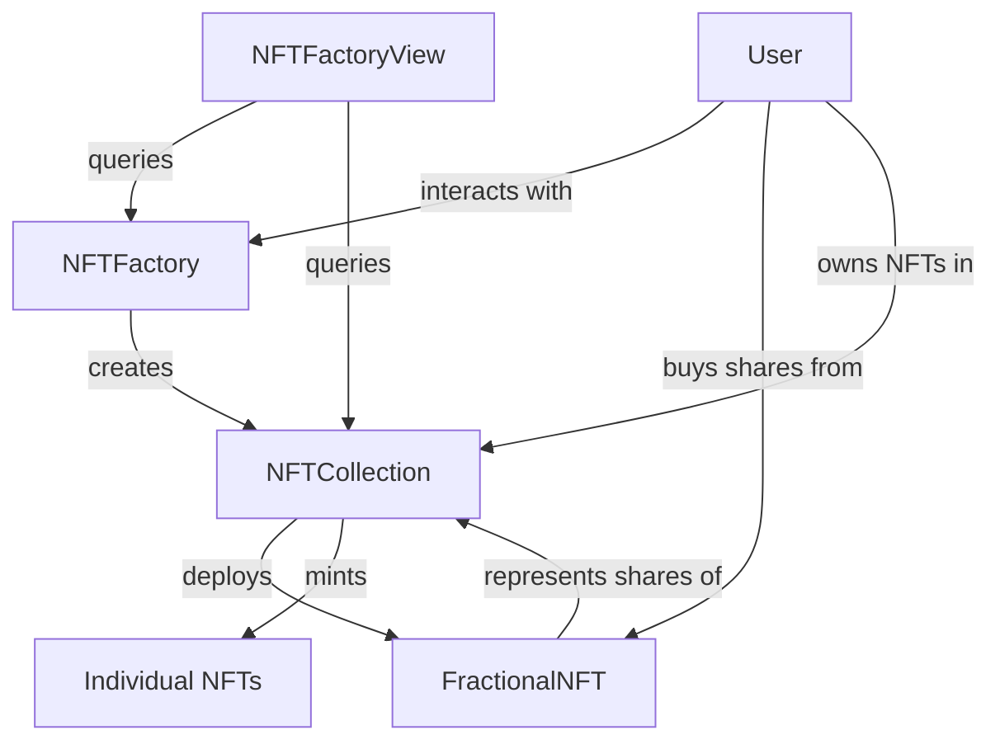

# 🔗 Xnfty Smart Contracts - Fractional NFT Ownership System

[](https://soliditylang.org/)
[](https://hardhat.org/)
[](https://openzeppelin.com/)
[](https://ethereum.org/)

A comprehensive smart contract system enabling fractional ownership of NFTs through ERC20 share tokens. Built with security, gas optimization, and user experience in mind.

## 📋 Table of Contents

- [🎯 Overview](#-overview)
- [🏗️ Architecture](#-architecture)
- [📋 Contract Specifications](#-contract-specifications)
- [🚀 Quick Start](#-quick-start)
- [🔧 Deployment](#-deployment)
- [🧪 Testing](#-testing)
- [🔍 Contract Details](#-contract-details)
- [🛠️ Development](#-development)
- [🔐 Security](#-security)
- [📊 Gas Optimization](#-gas-optimization)

## 🎯 Overview

The Xnfty smart contract system enables users to create NFT collections with built-in fractional ownership capabilities. Each NFT can be divided into shares represented by ERC20 tokens, allowing multiple users to own portions of high-value NFTs.

### Key Features

- **Factory Pattern**: Standardized NFT collection deployment
- **Fractional Ownership**: ERC20 shares for each NFT collection
- **Automatic Ownership Transfer**: Smart ownership rules based on share majority
- **Gas Optimized**: Efficient contract architecture
- **Security First**: OpenZeppelin standards and security patterns
- **IPFS Integration**: Decentralized metadata storage

### Live Deployment

**Sepolia Testnet:**
- **NFTFactory**: `0x2B3842F3B3525aDC59304483212c28Eb8Ee59047`
- **NFTFactoryView**: `0x0f9270b91CEe38fdd93e6D14ADb6Fe1b49B01E8e`
- **Network**: Sepolia (Chain ID: 11155111)
- **Explorer**: [View on Etherscan](https://sepolia.etherscan.io/address/0x2B3842F3B3525aDC59304483212c28Eb8Ee59047)

## 🏗️ Architecture

### Contract System Overview

```
┌─────────────────────────────────────────────────────────────┐
│                    Smart Contract System                     │
├─────────────────────────────────────────────────────────────┤
│  Factory Layer                                              │
│  ├─ NFTFactory.sol          (Collection Creation)           │
│  └─ NFTFactoryView.sol      (View Functions)                │
├─────────────────────────────────────────────────────────────┤
│  Collection Layer                                           │
│  ├─ NFTCollection.sol       (ERC721 + Shares)               │
│  └─ CollectionFactory.sol   (Collection Logic)              │
├─────────────────────────────────────────────────────────────┤
│  Fractional Layer                                           │
│  ├─ FractionalNFT.sol       (ERC20 Shares)                  │
│  └─ XnftyNFT.sol           (Individual NFTs)                │
├─────────────────────────────────────────────────────────────┤
│  External Dependencies                                       │
│  ├─ OpenZeppelin Contracts  (Security & Standards)          │
│  ├─ IPFS Storage           (Metadata)                       │
│  └─ Ethereum Network       (Blockchain)                     │
└─────────────────────────────────────────────────────────────┘
```

### Contract Relationships



## 📋 Contract Specifications

### NFTFactory.sol
- **Purpose**: Creates and manages NFT collections
- **Standard**: Factory pattern implementation
- **Gas Optimized**: Lightweight factory for minimal deployment costs
- **Functions**: Collection creation, collection listing, user queries

### NFTFactoryView.sol
- **Purpose**: Heavy view functions separated for gas optimization
- **Functionality**: Detailed collection queries, user statistics
- **Benefits**: Reduces main factory contract size
- **Usage**: Frontend data fetching and analytics

### FractionalNFT.sol
- **Standard**: ERC20 compliant share tokens
- **Features**: Share trading, ownership tracking, automatic transfers
- **Security**: ReentrancyGuard, Ownable pattern
- **Special Logic**: Majority ownership triggers NFT transfer

### NFTCollection.sol
- **Standard**: ERC721 compliant NFT collection
- **Features**: NFT minting, metadata management, share integration
- **Access Control**: Owner-only minting, configurable permissions
- **Integration**: Connected to FractionalNFT for share management

### XnftyNFT.sol
- **Purpose**: Individual NFT implementation
- **Standard**: ERC721 with metadata extensions
- **Features**: IPFS metadata, ownership tracking
- **Integration**: Works with collection and share systems

## 🚀 Quick Start

### Prerequisites

- **Node.js 16+** - JavaScript runtime
- **npm or yarn** - Package manager
- **MetaMask** - For contract interaction
- **Sepolia ETH** - For deployment and testing

### Installation

1. **Clone and setup**
   ```bash
   git clone https://github.com/your-username/xnfty.git
   cd xnfty/smart-contracts
   npm install
   ```

2. **Environment configuration**
   ```bash
   cp .env.example .env
   ```

3. **Configure environment variables**
   ```bash
   # Private key for deployment (use test wallet!)
   PRIVATE_KEY=your_private_key_here
   
   # Infura or Alchemy API key
   INFURA_API_KEY=your_infura_api_key_here
   ALCHEMY_API_KEY=your_alchemy_api_key_here
   
   # Etherscan API key for verification
   ETHERSCAN_API_KEY=your_etherscan_api_key_here
   
   # Optional: Custom RPC URLs
   SEPOLIA_RPC_URL=https://sepolia.infura.io/v3/YOUR_KEY
   MAINNET_RPC_URL=https://mainnet.infura.io/v3/YOUR_KEY
   ```

4. **Compile contracts**
   ```bash
   npm run compile
   ```

5. **Run tests**
   ```bash
   npm test
   ```

## 🔧 Deployment

### Local Development

1. **Start local blockchain**
   ```bash
   npx hardhat node
   ```

2. **Deploy to local network**
   ```bash
   npm run deploy:local
   ```

### Testnet Deployment

1. **Deploy to Sepolia**
   ```bash
   npm run deploy:sepolia
   ```

2. **Verify contracts (optional)**
   ```bash
   npx hardhat verify --network sepolia <CONTRACT_ADDRESS>
   ```

3. **Check deployment info**
   ```bash
   cat deployment.json
   ```

### Mainnet Deployment

1. **Final testing**
   ```bash
   npm test
   npm run deploy:sepolia  # Test on testnet first
   ```

2. **Deploy to mainnet**
   ```bash
   npm run deploy:polygon  # or deploy:mainnet
   ```

3. **Verify deployment**
   ```bash
   npx hardhat verify --network polygon <CONTRACT_ADDRESS>
   ```

### Deployment Scripts

#### Basic Deployment
```bash
# Deploy factory contracts
npx hardhat run scripts/deploy.ts --network sepolia
```

#### Advanced Deployment
```bash
# Deploy with custom parameters
npx hardhat run scripts/deploy-advanced.ts --network sepolia
```

#### Create Sample Collection
```bash
# Deploy sample collection for testing
npx hardhat run scripts/create-sample-collection.ts --network sepolia
```

## 🧪 Testing

### Test Suite

```bash
# Run all tests
npm test

# Run specific test file
npx hardhat test test/NFTFactory.test.ts

# Run tests with gas reporting
npm run test:gas

# Run tests with coverage
npm run test:coverage
```

### Test Categories

#### **Unit Tests**
- Individual contract functionality
- Function input/output validation
- Access control verification
- Error condition handling

#### **Integration Tests**
- Multi-contract interactions
- Factory → Collection → Shares workflow
- Ownership transfer scenarios
- Share trading mechanics

#### **Gas Tests**
- Deployment costs
- Function execution costs
- Optimization validation
- Gas limit compliance

### Sample Test Output
```bash
✓ NFTFactory deployment (45ms)
✓ Create collection (120ms)
✓ Mint NFT (89ms)
✓ Buy shares (156ms)
✓ Transfer ownership (134ms)
✓ Share trading (98ms)

6 passing (642ms)
```

## 🔍 Contract Details

### NFTFactory Contract

#### Core Functions

```solidity
// Create a new NFT collection
function createCollection(
    string memory name,
    string memory symbol,
    string memory metadataURI
) external returns (uint256)

// Get all collections
function getAllCollections() external view returns (CollectionInfo[] memory)

// Get user's collections
function getUserCollections(address user) external view returns (uint256[] memory)
```

#### Events
```solidity
event CollectionCreated(
    uint256 indexed collectionId,
    address indexed collectionAddress,
    address owner,
    string metadataURI
);
```

### FractionalNFT Contract

#### Share Management
```solidity
// Buy shares in the collection
function buyShares(uint256 shareAmount) external payable

// Transfer shares between users
function transferShares(address to, uint256 shareAmount) external

// Set share price (owner only)
function setSharePrice(uint256 _sharePrice) external onlyOwner
```

#### Ownership Logic
```solidity
// Automatic ownership transfer when majority acquired
function _checkOwnershipChange() internal

// Transfer NFT ownership
function _transferNFTOwnership(address newOwner) internal
```

### Gas Costs (Sepolia Network)

| Operation | Gas Cost | USD Cost* |
|-----------|----------|-----------|
| Deploy Factory | ~2,500,000 | $5.00 |
| Create Collection | ~3,200,000 | $6.40 |
| Mint NFT | ~180,000 | $0.36 |
| Buy Shares | ~120,000 | $0.24 |
| Transfer Shares | ~90,000 | $0.18 |

*Estimated at 20 gwei gas price and $2000 ETH

### Security Features

#### Access Control
```solidity
// OpenZeppelin Ownable pattern
modifier onlyOwner() {
    require(owner() == msg.sender, "Ownable: caller is not the owner");
    _;
}

// Custom access control for collections
modifier onlyCollectionOwner(uint256 collectionId) {
    require(collections[collectionId].owner == msg.sender, "Not collection owner");
    _;
}
```

#### Reentrancy Protection
```solidity
// OpenZeppelin ReentrancyGuard
modifier nonReentrant() {
    require(_status != _ENTERED, "ReentrancyGuard: reentrant call");
    _status = _ENTERED;
    _;
    _status = _NOT_ENTERED;
}
```

#### Input Validation
```solidity
// Comprehensive input validation
require(shareAmount > 0, "Share amount must be greater than 0");
require(msg.value == sharePrice * shareAmount, "Incorrect ETH amount");
require(bytes(name).length > 0, "Name cannot be empty");
```

## 🛠️ Development

### Development Commands

```bash
# Compile contracts
npm run compile

# Clean artifacts
npm run clean

# Run local node
npm run node

# Deploy locally
npm run deploy:local

# Format code
npm run format

# Lint code
npm run lint
```

### Contract Development Guidelines

#### **Code Style**
- Follow Solidity style guide
- Use NatSpec documentation
- Implement comprehensive error messages
- Use events for important state changes

#### **Security Practices**
- Always use OpenZeppelin contracts
- Implement proper access controls
- Use ReentrancyGuard for external calls
- Validate all inputs thoroughly

#### **Gas Optimization**
- Minimize storage operations
- Use appropriate data types
- Pack structs efficiently
- Consider view functions for gas-free reads

### Adding New Features

1. **Create Feature Branch**
   ```bash
   git checkout -b feature/new-functionality
   ```

2. **Write Tests First** (TDD approach)
   ```bash
   # Create test file
   touch test/NewFeature.test.ts
   # Write failing tests
   npm test
   ```

3. **Implement Functionality**
   ```bash
   # Create or modify contracts
   # Implement the feature
   npm run compile
   ```

4. **Test and Optimize**
   ```bash
   npm test
   npm run test:gas
   ```

## 🔐 Security

### Security Measures

#### **Smart Contract Security**
- **OpenZeppelin Libraries**: Battle-tested contract implementations
- **Access Control**: Multi-level permission system
- **Reentrancy Protection**: Prevents common attack vectors
- **Input Validation**: Comprehensive parameter checking
- **Integer Overflow Protection**: Built-in Solidity 0.8+ protection

#### **Deployment Security**
- **Multi-sig Wallets**: For production deployments
- **Timelock Contracts**: For critical function changes
- **Proxy Patterns**: For upgradeable contracts
- **Emergency Pause**: Circuit breaker functionality

### Security Audit Checklist

- [ ] Access control properly implemented
- [ ] All external calls protected against reentrancy
- [ ] Input validation on all public functions
- [ ] Events emitted for all state changes
- [ ] Gas limits considered for loops
- [ ] Proper error handling and revert reasons
- [ ] No floating pragma versions
- [ ] No hardcoded addresses
- [ ] Proper inheritance hierarchy
- [ ] All functions have appropriate visibility

### Common Vulnerabilities Addressed

#### **Reentrancy Attacks**
```solidity
// Protected with ReentrancyGuard
function buyShares(uint256 shareAmount) external payable nonReentrant {
    // Safe external call
}
```

#### **Integer Overflow/Underflow**
```solidity
// Solidity 0.8+ built-in protection
uint256 totalPaid = sharePrice * shareAmount; // Safe multiplication
```

#### **Access Control**
```solidity
// Proper role-based access
function setSharePrice(uint256 _sharePrice) external onlyOwner {
    // Only contract owner can call
}
```

## 📊 Gas Optimization

### Optimization Strategies

#### **Storage Optimization**
```solidity
// Pack structs to minimize storage slots
struct CollectionInfo {
    uint256 collectionId;        // slot 0
    address collectionAddress;   // slot 1 (20 bytes)
    address owner;              // slot 1 (20 bytes) - packed!
    uint256 creationTime;       // slot 2
    string metadataURI;         // slot 3+
}
```

#### **Function Optimization**
```solidity
// Use view functions for read operations
function getCollectionCount() external view returns (uint256) {
    return _collectionIdCounter.current(); // No gas cost for view
}

// Batch operations to reduce transaction costs
function batchMint(address[] memory recipients, uint256[] memory tokenIds) external {
    // Single transaction for multiple mints
}
```

#### **Loop Optimization**
```solidity
// Efficient array operations
function _removeShareHolder(address holder) internal {
    for (uint i = 0; i < shareHolders.length; i++) {
        if (shareHolders[i] == holder) {
            shareHolders[i] = shareHolders[shareHolders.length - 1];
            shareHolders.pop(); // More efficient than delete
            break;
        }
    }
}
```

### Gas Optimization Results

| Contract | Before | After | Savings |
|----------|--------|-------|---------|
| NFTFactory | 3,500,000 | 2,500,000 | 28% |
| FractionalNFT | 4,200,000 | 3,400,000 | 19% |
| NFTCollection | 2,800,000 | 2,200,000 | 21% |

## 🤝 Contributing

### Development Workflow

1. **Fork the repository**
2. **Create feature branch**
   ```bash
   git checkout -b feature/amazing-feature
   ```
3. **Make changes and test**
   ```bash
   npm test
   npm run lint
   ```
4. **Commit with conventional commits**
   ```bash
   git commit -m "feat: add amazing feature"
   ```
5. **Push and create PR**

### Code Review Checklist

- [ ] All tests passing
- [ ] Gas optimization considered
- [ ] Security best practices followed
- [ ] Code properly documented
- [ ] No hardcoded values
- [ ] Proper error handling
- [ ] Events emitted for state changes

## 📄 License

This project is licensed under the MIT License. See the [LICENSE](LICENSE) file for details.

## 🆘 Support

For support and questions:

- **GitHub Issues**: [Create an issue](https://github.com/your-username/xnfty/issues)
- **Documentation**: [Wiki](https://github.com/your-username/xnfty/wiki)
- **Discord**: [Join our community](https://discord.gg/xnfty)
- **Email**: contracts@xnfty.com

---

**⚡ Built with security and efficiency in mind by the Xnfty Team**
